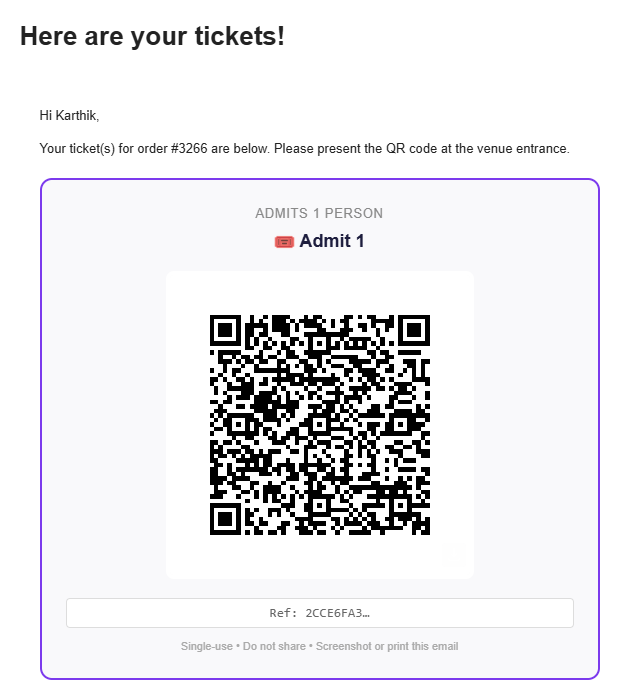
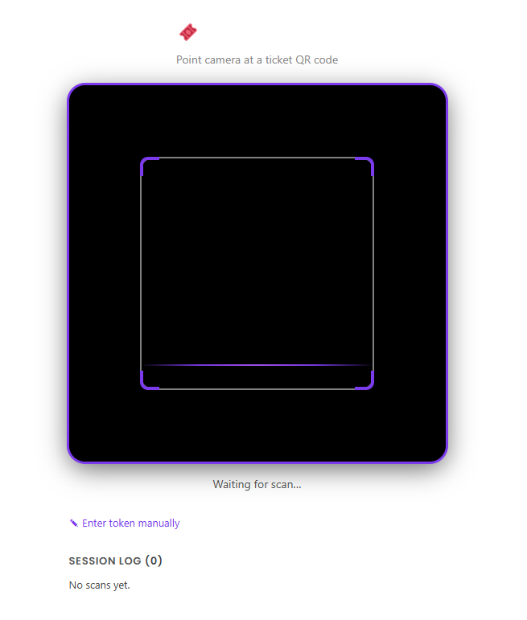
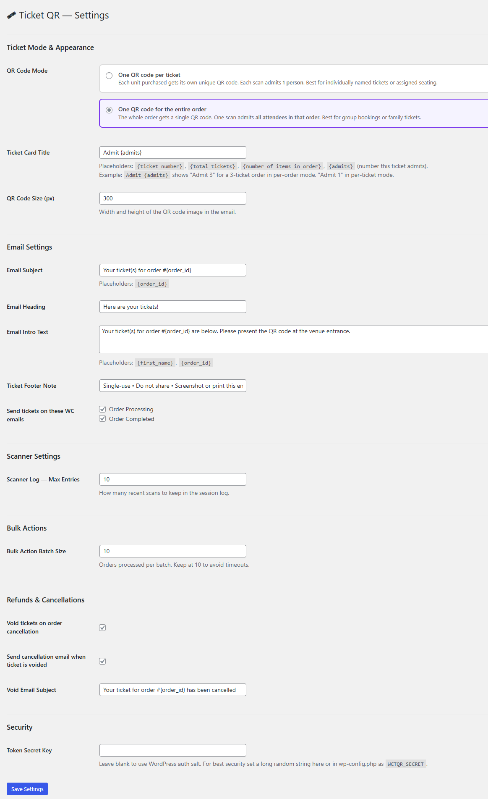

# WooCommerce Ticket QR

[](https://wordpress.org)
[](https://woocommerce.com)
[](https://php.net)
[](https://www.gnu.org/licenses/gpl-2.0.html)

Turn any WooCommerce product into an event ticket with unique, single-use QR codes — no third-party services required.



---

## ✨ Features

- **Unique QR code per ticket** — cryptographically secure HMAC token, one per unit purchased
- **Single-use enforcement** — atomic database lock prevents double-scanning, even under concurrent requests
- **PDF ticket attachment** — professional landscape-format ticket PDF sent with the confirmation email
- **Inline QR in email** — QR code embedded directly in the email body as a hosted image (works in Gmail, Apple Mail, Outlook)
- **Variable product support** — works with ticket type variations (Adult/Child/VIP etc.)
- **Browser-based door scanner** — staff open a page on any phone, scan QR codes with the camera
- **Expandable scan log** — last 10 scans kept with full attendee details, expandable on tap
- **Retroactive sending** — generate and resend tickets for any existing order from the order edit screen
- **Bulk action** — select multiple orders and send all ticket emails in one click (batched to avoid timeouts)
- **Refund invalidation** — full and partial refunds automatically void the corresponding tickets
- **Configurable settings** — email content, ticket appearance, batch size, and more

---

## 📸 Screenshots

| Email with QR | Door Scanner | Admin Tickets |
|---|---|---|
|  |  |  |

---

## 🚀 Installation

### From ZIP (manual)

1. Download the latest release ZIP from the [Releases page](../../releases)
2. In WordPress admin go to **Plugins → Add New → Upload Plugin**
3. Upload the ZIP and activate
4. Install the FPDF library (see [PDF Tickets](#pdf-tickets) below)

### From WordPress.org *(coming soon)*

Search for **WooCommerce Ticket QR** in **Plugins → Add New**.

---

## ⚙️ Setup

### 1. Mark a product as a ticket

Edit any WooCommerce product → **Product Data → General tab** → check **"This product is a ticket"**.

Optionally fill in **Event Date** and **Event Venue** — these appear on the PDF and in the scanner result.

### 2. Configure email (optional)

Go to **WooCommerce → Ticket QR: Settings** to customise:
- Email subject and heading
- Body text (supports `{first_name}` and `{order_id}` placeholders)
- Which WooCommerce order emails trigger ticket delivery
- QR code image size

### 3. Set up the door scanner

A **Ticket Scanner** page is created automatically on activation at `yoursite.com/ticket-scanner/`.

Staff members must be logged in with **Shop Manager** or **Administrator** role. Open the page on any smartphone, point at a ticket QR code, and the result appears instantly.

### 4. Bulk send tickets

In **WooCommerce → Orders**, select multiple orders, choose **"Generate & Send Ticket QR"** from the bulk actions dropdown, and click **Apply**. Orders are processed in configurable batches with a live progress screen.

---

## 📄 PDF Tickets

PDF generation requires the free **FPDF** library.

1. Download from [fpdf.org](http://www.fpdf.org/)
2. Place `fpdf.php` in `wp-content/plugins/wc-ticket-qr/lib/fpdf/fpdf.php`

If FPDF is not installed, tickets are still delivered with an inline QR code in the email body.

---

## 🔒 Security

- Tokens are **HMAC-SHA256** signed — cannot be forged without the server secret
- The scanner endpoint requires WordPress authentication (`manage_woocommerce` capability)
- Scan validation uses an **atomic `UPDATE WHERE scanned = 0`** query — concurrent duplicate scans are rejected at the database level
- Voided tickets return **HTTP 410 Gone**
- QR image files are protected by `.htaccess` — PHP execution is blocked in the upload directory

### Recommended: set a secret key

Add to `wp-config.php`:
```php
define( 'WCTQR_SECRET', 'your-long-random-secret-string' );
```

---

## 🔌 REST API

The scanner endpoint can be used by any scanning app:

```
POST https://yoursite.com/wp-json/wctqr/v1/validate/{64-char-token}
Headers: X-WP-Nonce: {wp_rest_nonce}
```

### Responses

| HTTP | Meaning |
|------|---------|
| `200 OK` | Valid ticket — entry granted |
| `404 Not Found` | Token not recognised |
| `409 Conflict` | Ticket already scanned |
| `410 Gone` | Ticket voided (refunded/cancelled) |

### Example 200 response

```json
{
  "valid": true,
  "message": "Valid ticket — entry granted.",
  "order_id": 1234,
  "ticket_ref": "A1B2C3D4",
  "attendee": "Jane Smith",
  "email": "jane@example.com",
  "product_name": "Summer Gala 2026",
  "variation": "VIP",
  "event_date": "Saturday 4 July 2026, 7:00 PM",
  "event_venue": "The Grand Ballroom",
  "ticket_number": "Ticket 1 of 2",
  "scanned_at": "2026-07-04 18:45:32"
}
```

---

## 🛠 Requirements

- WordPress 6.0+
- WooCommerce 7.0+
- PHP 7.4+
- GD or Imagick PHP extension (for QR image generation)
- FPDF library (optional, for PDF attachments)
- HTTPS (required for camera access on the scanner page)

---

## 🤝 Contributing

Pull requests are welcome! Please:

1. Fork the repository
2. Create a feature branch (`git checkout -b feature/my-feature`)
3. Commit your changes (`git commit -m 'Add my feature'`)
4. Push to the branch (`git push origin feature/my-feature`)
5. Open a Pull Request

### Development setup

```bash
git clone https://github.com/YOUR_USERNAME/wc-ticket-qr.git
cd wc-ticket-qr
# Place in wp-content/plugins/ of a local WordPress install
```

---

## 📋 Changelog

### 1.1.0
- Added configurable settings panel
- Added bulk order action with batched processing and live progress
- Expandable scan log with full attendee details
- Settings-driven email content (subject, heading, body, footer)
- Configurable batch size, log length, and QR image size

### 1.0.0
- Initial release
- Unique HMAC QR token generation
- PDF ticket generation with FPDF
- REST API validation endpoint
- Retroactive QR generation and resend
- Full and partial refund invalidation
- Browser-based door scanner with ZXing

---

## 📜 License

[GPL v2 or later](https://www.gnu.org/licenses/gpl-2.0.html) — same as WordPress.

---

## 🙏 Credits

Built by [Karthik Umashankar](https://github.com/Kaptnik) for [Seattle Kannada Sangha](https://seattlekannadasangha.com).

QR image generation via [QRServer API](https://goqr.me/api/).  
PDF generation via [FPDF](http://www.fpdf.org/).  
Scanner library: [ZXing](https://github.com/zxing-js/library).
